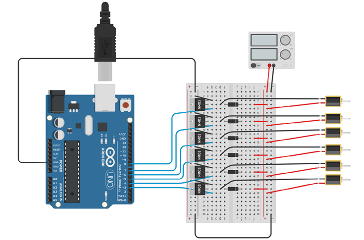

# ASR-Translation-Braille-Output
An AI-based accessibility system that translates foreign video content into Korean braille output for visually impaired users.

# Video-to-Braille Translation System

## System Pipeline

  
   
  <em>Overall pipeline of the video-to-braille translation system</em>

## Hardware Implementation

  
   
  <em>Arduino-based braille output circuit</em>

  
   
  <em>Prototype braille output module</em>

## Overview

This project is a prototype system that converts video content into braille output.

The system extracts audio and visual information from an input video, recognizes spoken dialogue using ASR, generates captions from video frames, translates the extracted text into Korean, converts the translated text into braille, and sends the braille output to an Arduino-based braille display device.

## Project Motivation

With the increasing consumption of video content, accessibility for visually impaired users has become an important issue.  
This project aims to support video accessibility by converting both spoken dialogue and visual scene information into braille-readable output.

## Main Features

- Extracts audio from an input video
- Recognizes spoken dialogue using a Whisper-based ASR module
- Extracts video frames at regular intervals
- Generates scene descriptions using an image captioning model
- Translates recognized dialogue and visual captions into Korean using an mBART-based translation model
- Converts translated Korean text into braille
- Sends braille output to an Arduino-based hardware module
